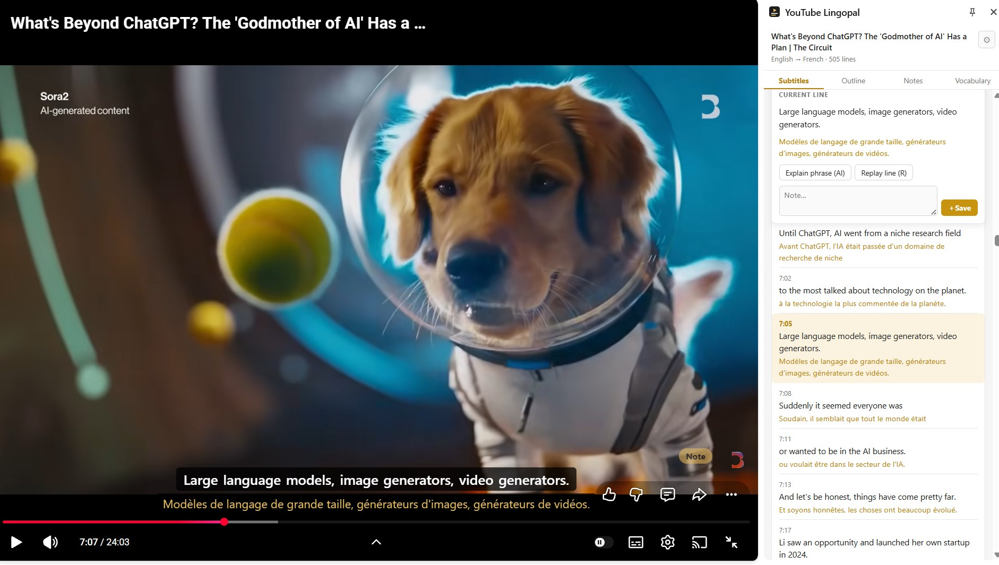

# YouTube Lingopal

*[English](README.md)*

> **YouTube 学外语的搭子，看学两不误。** 双语字幕、点词即懂、笔记速存。

可把字幕译成**中文、英语或法语**，支持双语显示，即时翻译。



---

## 主要功能

| | |
|---|---|
| **字幕浮层** | 视频画面上的字幕，可选**双语 / 只看原文 / 只看译文** |
| **字幕全文** | 侧边栏显示带时间戳的整篇字幕，点时间戳跳转 |
| **一键笔记** | 按下 `Note` 或快捷键记录下这一句，自动存入笔记 |
| **查存生词** | 查过的或划选的单词和词组自动存入生词本 |

以上不填 API Key 也能用，首次提示点「先跳过」即可。

### 需要 API Key

| | |
|---|---|
| **悬停取词** | 鼠标划过单词即时显示词义 |
| **点词解释** | 点字幕里任意一个词，弹出卡片解释它在这句话里的意思 |
| **词组解释** | 在「当前句」里划选一个词组，点按钮解释 |
| **用法解释** | 生词栏里的按钮。讲这个词**怎么用**：常见搭配、什么场合什么口吻、容易怎么用错 |
| **概述** | 按时间顺序列出视频每段的大意，点时间戳跳转 |
| **重新翻译全文** | 用 AI 重译整篇字幕 |

---

## 安装

### 用 AI 编程助手（Claude Code、Codex 等）

把下面这段发给它：

```
帮我安装 https://github.com/mindcove/youtube-lingopal 这个 Chrome 扩展：
放在哪里先问我，确定后开始安装。
clone 到那个文件夹，装完把完整路径告诉我，
再告诉我怎么在 chrome://extensions 里用「加载已解压的扩展程序」选中同一个文件夹。
```

### 手动安装

1. 点绿色的 `Code` → `Download ZIP`，解压到一个**固定文件夹**
2. 浏览器打开 `chrome://extensions`
3. 打开右上角**开发者模式**
4. 点左上角**加载已解压的扩展程序**，选中刚解压的文件夹
5. 打开一个带字幕的 YouTube 视频，点工具栏里的 YouTube Lingopal（可能收在 🧩 菜单里，点 📌 可以固定出来），或页面右下角的黄色 `YT Pal` 按钮

需要 Chrome 116 或更高版本。

---

## API Key 配置与费用

**界面上标注 AI 的功能都会产生费用**，其余功能不填 Key 也能用。

如果你还没有 API Key，可在 [platform.deepseek.com](https://platform.deepseek.com) 注册创建（`sk-` 开头）。

安装后第一次打开会提示填 Key，之后也可以在侧边栏右上角的齿轮 ⚙ 里改。

**Key 只存在你自己电脑的 Chrome 里，不会上传到任何服务器。** 它只会被发往你自己填的那个 API 地址。

> ⚠️ **不要把 API Key 贴进 AI 对话、代码、截图或任何可能公开的地方**，请直接在设置里填写。万一泄露了，去 DeepSeek 后台把那个 Key 删掉、重新创建一个。

| 功能 | 单次 |
|---|---|
| 悬停取词 | ¥0.0002 – 0.0004 |
| 点词解释 / 词组解释 | ¥0.002 – 0.006 |
| 用法解释 | ¥0.005 – 0.015 |
| 概述 | ¥0.007 – 0.045（每个视频只算一次，之后走缓存） |
| 重新翻译全文 | 20 分钟视频 ¥0.3 – 0.7 |
| 断句辅助（自动，见下） | ¥0.0003 – 0.0005 |

经测试估算，一个 20 分钟的视频，**点 3 次点词解释** + **悬停 5 个词** + **生成一次概述**，大约 **¥0.01 – 0.06**。

> **断句辅助**：老式自动字幕没有标点时，规则判断不出一句话在哪结束，按 `N` 或点击 `Note` 存笔记会触发一次 AI 断句。只在「无标点字幕 + Note」同时成立时发生，新视频的自动字幕大多已带标点，很少用到。它计入用量统计的总额。

设置页的「AI 用量统计」记的是**每次调用的真实 token 数**，按功能分开列，可清零；里面的金额是拿单价算出来的估值，**实际扣费以 DeepSeek 账单为准**。

> 接口兼容 OpenAI 格式。只在 DeepSeek 上验证过。

---

## 使用方法

**只对带字幕(CC)的 YouTube 视频有效**——播放器里有 CC 按钮就是有。

**打开面板**：工具栏上的插件图标，或视频页右下角的 `YT Pal` 悬浮按钮。

### 字幕显示

字幕页工具栏的**视图**可以切换**双语 / 只看原文 / 只看译文**，视频浮层和侧边栏一起变。

### 快捷键

| 键 | 作用 | 在哪 |
|---|---|---|
| `N` | 存下刚说完的一句 | 视频上 |
| `R` | 重放当前这一句 | 视频上 |
| `V` | 把词或词组存进生词本 | 侧边栏字幕或「当前句」里划选，或视频上鼠标停在某个词上 |
| `H` | 给划选的文字加/去高亮 | 笔记页、生词页 |

在编辑输入框里打字时这些键不会触发。

### 笔记和生词

两页的卡片都可以：

- **编辑** —— 原文和译文分开改
- **重听** —— 跳回视频里这句话的位置重播
- **复制** —— 复制原文，或原文加译文加注解一起复制
- **删除**
- 笔记可以编辑添加**注解**

### 笔记存错了

存完弹出的提示条上有三个出口：**往前多存一句**（可连续点击）、**撤销**（删掉刚存的）、**✕**（关闭）。

### 高亮

查过的词会在例句里自动高亮。还可在笔记或生词卡片里直接划选按 `H`。导出成 Markdown 时高亮写成 `==词==`，HTML 导出保留真实的底色。

### 导出与备份

笔记页和生词页顶部都有导出，可任选**笔记 / 生词 / 字幕全文**，支持 Markdown、HTML、CSV，字幕全文可选原文 / 译文 / 双语。

**数据备份**在设置页最下面，导出一份 JSON，重装扩展后可以导入还原。建议装好之后先备份一次 —— 数据存在 Chrome 里，**移动或删除安装文件夹、卸载扩展，都会让它读不到**。

### 默认关闭的功能

- **悬停取词**：鼠标划过每个新词都会调一次 API，开启需要在设置里勾选。
- **翻译质量优先**：关闭时整句和整篇翻译用 YouTube 自带的字幕翻译；勾选后将调用 API 翻译。

### 界面语言

设置里可选**中文 / English / 跟随浏览器**，随时切换。界面语言和翻译的目标语言是两回事，分开设置。

---

## 常见问题

**提示「这个视频没有字幕(CC)」**
这个视频本身没有字幕轨道，插件对它无效。

**提示「无法获取字幕鉴权信息」**
在播放器里手动开一次字幕(CC)，然后刷新页面。

**点了按钮没反应**
先刷新一次 YouTube 页面。还是不行的话，`chrome://extensions` 里点一下这个扩展的刷新图标，再刷新页面。

**原文语言识别错了**
少数视频挂了十几条人工字幕，插件判断不出哪条是原声。字幕页工具栏有「原文」下拉框，选正确的那个，选择会按视频记住。

---

## 数据与隐私

笔记、生词、设置、API Key 全部只存在你自己电脑的 Chrome 里。插件只和两个地方通信：YouTube（取字幕）和你自己配置的 API 地址。没有分析、没有埋点。

---

## 许可

MIT，见 [LICENSE](LICENSE)。
